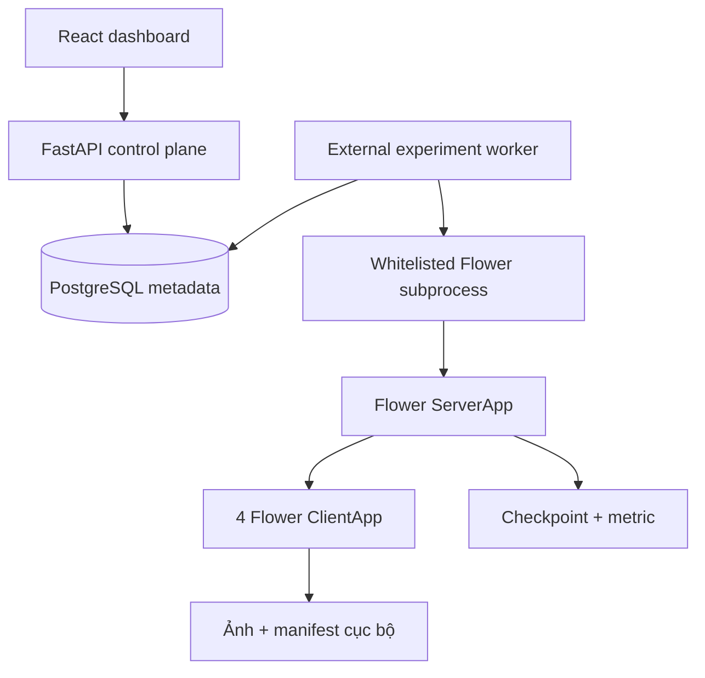
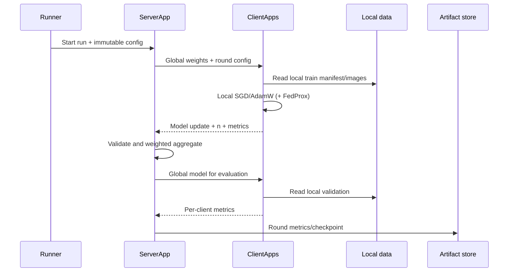

# 02 — Kiến trúc tổng thể

## 1. Kiến trúc logic



Ranh giới quan trọng: nhánh `LOCAL → CLIENTS` chỉ tồn tại ở cơ sở. Không có cạnh đưa ảnh từ `CLIENTS` tới `SERVER`.

## 2. Thành phần và trách nhiệm

| Thành phần | Trách nhiệm | Không được làm |
|---|---|---|
| React dashboard | nhập config, xem trạng thái/metric | không trực tiếp train, không giữ ảnh |
| FastAPI | validate request, quản lý metadata, API | không chạy image training dài trong web worker |
| PostgreSQL | experiment, trạng thái, config, metric index | không lưu ảnh thô |
| Experiment runner | sinh process Flower, thu log/artifact | không thay đổi config sau khi run |
| Flower ServerApp | chọn strategy, phát model, aggregate, checkpoint | không đọc client train manifest |
| Flower ClientApp | đọc manifest local, train/evaluate, trả update | không truy cập dữ liệu client khác |
| PyTorch layer | model, transform, loss, metric | không chứa logic HTTP |
| Artifact store | checkpoint, JSON/CSV metric, figure | không trộn smoke result với result thật |

## 3. Topology Flower

MVP dùng **cross-silo simulation**: bốn node đại diện bốn cơ sở, tất cả tham gia mỗi round. Theo kiến trúc Flower hiện hành:

- server side có SuperLink/SuperExec/`ServerApp`;
- client side có SuperNode/SuperExec/`ClientApp`;
- code đồ án chủ yếu triển khai `ServerApp` và `ClientApp`;
- local simulation được gọi bằng `flwr run`.

Tài liệu chính thức: [Flower Architecture](https://flower.ai/docs/framework/explanation-flower-architecture.html).

## 4. Luồng một vòng huấn luyện



## 5. Công thức tổng hợp

Với client \(k\) có \(n_k\) mẫu và local weights \(w_{t+1}^{k}\):

\[
w_{t+1} = \sum_{k=1}^{K}\frac{n_k}{\sum_j n_j}w_{t+1}^{k}
\]

FedProx dùng cùng server aggregation, nhưng local objective thêm:

\[
\min_w F_k(w) + \frac{\mu}{2}\lVert w-w_t\rVert_2^2
\]

Trong code, hạng proximal dùng **tổng bình phương sai khác tham số**, không dùng norm chưa bình phương.

## 6. Luồng dữ liệu và trust boundary

| Dữ liệu | Nơi sinh | Nơi được phép tồn tại |
|---|---|---|
| ảnh huấn luyện/validation | client | client |
| path ảnh trong manifest | client | client |
| global test PlantVillage mô phỏng | nghiên cứu viên | server đánh giá hoặc máy thí nghiệm |
| model update | client | client → coordinator |
| số mẫu và metric | client | client → coordinator/database |
| global checkpoint | coordinator | artifact store; phân phối client |
| secret/TLS key | deployment | secret store; không commit |

Global test trên server là lựa chọn phục vụ nghiên cứu mô phỏng. Khi triển khai thật nghiêm ngặt, có thể chỉ dùng federated evaluation hoặc một public benchmark test.

## 7. API hiện tại

| Method | Path | Mục đích |
|---|---|---|
| GET | `/health` | healthcheck |
| GET | `/health/ready` | readiness (database) |
| GET | `/api/v1/auth/me` | vai trò của token đang dùng |
| GET | `/api/v1/project` | tên đề tài, phạm vi đã khóa |
| GET | `/api/v1/classes` | taxonomy đang cấu hình (38 lớp mặc định, `CROPFED_TAXONOMY_SCOPE`) |
| GET | `/api/v1/data-profiles` | count/phân bố lớp theo client; không trả ảnh hoặc local path |
| POST | `/api/v1/experiments` | lưu config |
| GET | `/api/v1/experiments` | danh sách run |
| GET | `/api/v1/experiments/{id}` | chi tiết |
| POST | `/api/v1/experiments/{id}/start` | chạy synthetic smoke hoặc xếp hàng Flower |
| GET | `/api/v1/experiments/{id}/rounds` | metric synthetic/Flower theo round |
| GET | `/api/v1/experiments/{id}/clients` | metric và communication payload theo từng client/phase |
| GET | `/api/v1/experiments/compare` | so sánh nhiều run: metric cuối, fairness (std/spread giữa client) và khoảng cách vs centralized |
| GET | `/api/v1/experiments/export-csv` | xuất bảng so sánh dạng CSV |
| GET | `/api/v1/clients` | danh sách cơ sở |
| GET | `/api/v1/clients/{id}/status` | trạng thái một cơ sở |
| GET | `/api/v1/checkpoints` | checkpoint đã triển khai |
| POST | `/api/v1/predict` | phân loại một ảnh |

Endpoint `compare` lấy mốc centralized từ `CROPFED_CENTRALIZED_BASELINE_RESULT` —
đường dẫn phía server như mọi đường dẫn khác (D-019), HTTP không cấp được. Thiếu mốc
thì cột gap trả `null`, không phải `0.0` (D-036).

Với `execution_mode=synthetic-smoke`, FastAPI dùng background task nhẹ. Với
`execution_mode=flower`, endpoint chỉ chuyển trạng thái sang `queued`; tiến trình
`cropfed.api.worker` độc lập claim job, chạy lại data audit rồi gọi `flwr` bằng
danh sách argv, không qua shell. HTTP chỉ chọn enum/range đã khóa và không được
gửi command, đường dẫn dataset hay output path. Worker phải được bật rõ bằng
`CROPFED_FLOWER_WORKER_ENABLED=true`.

## 8. Mô hình dữ liệu hiện tại

`experiments` hiện lưu:

- identity: `id`, `name`;
- lifecycle: `status`, `execution_mode`, timestamps, error;
- config: algorithm, partition, clients, rounds, epochs, LR, batch, alpha, mu, seed;
- `result_json` cho synthetic result hoặc Flower validation/history/artifact index.

`experiment_rounds` hiện lưu một hàng cho mỗi round:

- khóa ghép `experiment_id`, `round_number`;
- payload metric gốc dạng JSON để truy vết;
- các cột scalar dùng truy vấn/biểu đồ: train/evaluation loss, accuracy, Macro-F1,
  harmful→healthy rate, elapsed và communication bytes nếu runner cung cấp.

API ưu tiên đọc bảng này và chỉ fallback sang `result_json` cho record cũ.

`client_round_metrics` hiện lưu một hàng cho mỗi `(experiment, round, client, phase)`:

- metric JSON và số mẫu;
- node/client identity;
- payload/model upload/download bytes.

Các bảng còn cần bổ sung:

- `artifacts(experiment_id, type, path, sha256, created_at)`;
- migration bằng Alembic.

## 9. Công nghệ

| Lớp | Công nghệ đã chọn | Lý do |
|---|---|---|
| DL | PyTorch/Torchvision | hệ sinh thái CV, transfer learning |
| FL | Flower Message API | simulation và deployment cùng abstraction |
| Model | MobileNetV2 | nhẹ hơn nhiều backbone lớn; hợp client hạn chế |
| API | FastAPI | type validation, OpenAPI |
| Metadata | SQLModel + PostgreSQL | schema rõ, đổi SQLite/Postgres thuận tiện |
| Frontend | React + Vite | dashboard đơn trang, build nhỏ |
| Đóng gói | Docker Compose | tái lập web/API/database |
| Metric/result | JSON/CSV + checkpoint `.pt` | dễ kiểm tra và vẽ biểu đồ |

## 10. Cấu trúc mã nguồn

```text
src/cropfed/
├── api/              # control plane + database-backed Flower worker
├── data/             # manifest + partition
├── experiments/      # centralized/local-only runners
├── fl/               # aggregation validation
├── flower/           # federated applications
├── ml/               # model, training, metric
├── config.py         # immutable validated config
├── constants.py      # official title + class contract
├── cli.py
└── simulation.py     # dependency-light smoke only
```

## 11. Nguyên tắc mở rộng

1. Web không phụ thuộc chi tiết PyTorch.
2. Flower code gọi chung trainer/model với centralized.
3. Partition logic độc lập framework và có unit test.
4. Mỗi run tạo artifact directory riêng, không ghi đè.
5. Thêm strategy mới qua factory; không nhân bản toàn bộ `ServerApp`.
6. Thêm dataset mới qua manifest adapter; không sửa taxonomy cà chua của checkpoint cũ.
