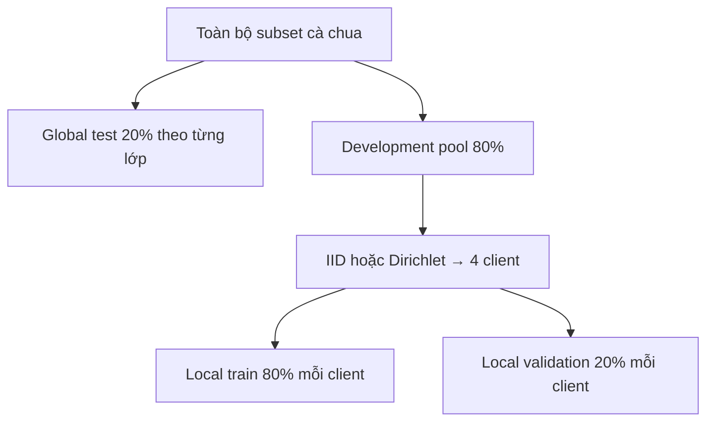

# 03 — Dữ liệu và mô phỏng Non-IID

> **Cập nhật 06–07/08/2026.** Phạm vi đã chuyển sang **38 lớp** (D-037) và **6
> profile** (D-038), và manifest đã chuyển sang **path tương đối** (D-033/D-034).
> Các mục dưới đây mô tả taxonomy 10 lớp và ba profile của mốc 0.1.0; chỗ nào đã
> đổi đều được ghi rõ tại chỗ.

## 1. Dataset chính

PlantVillage là nguồn chính vì:

- có nhãn crop–disease rõ;
- đủ lớn để tạo bốn client mô phỏng;
- được dùng rộng rãi và được dùng trong nghiên cứu FL sâu bệnh gần đề tài;
- nhóm cà chua có cả trạng thái khỏe, nhiều bệnh và lớp nhện hai chấm.

Bài báo gốc báo cáo 54.306 ảnh, 14 loài cây, 38 lớp crop–disease và 26 bệnh hoặc trạng thái khỏe. Xem [Mohanty et al., 2016](https://www.frontiersin.org/journals/plant-science/articles/10.3389/fpls.2016.01419/full) và [repository PlantVillage](https://github.com/spmohanty/plantvillage-dataset).

Con số trên mô tả **toàn bộ dataset**, không phải số ảnh của subset cà chua. Số ảnh thực tế của subset phải được lấy từ `partition_summary.json` sau khi scan, không chép một con số không kiểm chứng vào báo cáo.

Từ D-037, phạm vi chính **là** toàn bộ 38 lớp: đã scan thật được 54.305 ảnh, chia
**43.447 development pool / 10.858 global test** ở seed 2026; trong pool đó có
**34.757 local train + 8.690 local validation**. Vẫn giữ nguyên nguyên
tắc trên — lấy số từ `partition_summary.json`, không chép từ bài báo.

## 2. Mười thư mục đầu vào (mốc 0.1.0)

Bảng này là taxonomy `scope="tomato"`, giữ lại vì mọi checkpoint trước 06/08 dùng
đúng thứ tự ID đó. Taxonomy mặc định hiện nay là `scope="plantvillage-full"` với
đủ 38 thư mục, định nghĩa ở `constants.py: PLANTVILLAGE_FULL_FOLDER_TO_CLASS`.

| Folder PlantVillage | Nhãn chuẩn |
|---|---|
| `Tomato___healthy` | Tomato healthy |
| `Tomato___Bacterial_spot` | Bacterial spot |
| `Tomato___Early_blight` | Early blight |
| `Tomato___Late_blight` | Late blight |
| `Tomato___Leaf_Mold` | Leaf mold |
| `Tomato___Septoria_leaf_spot` | Septoria leaf spot |
| `Tomato___Target_Spot` | Target spot |
| `Tomato___Tomato_mosaic_virus` | Tomato mosaic virus |
| `Tomato___Tomato_Yellow_Leaf_Curl_Virus` | Tomato yellow leaf curl virus |
| `Tomato___Spider_mites Two-spotted_spider_mite` | Two-spotted spider mite |

CLI từ chối chạy nếu thiếu một folder. Không tự động bỏ qua lớp thiếu vì sẽ làm đổi taxonomy.

## 3. Manifest

Mỗi CSV có đúng các cột:

| Cột | Ý nghĩa |
|---|---|
| `image_id` | SHA-1 rút gọn của relative path, dùng kiểm tra trùng |
| `path` | đường dẫn ảnh **tương đối theo dataset root** cấp lúc chạy (D-033) |
| `label_id` | số theo class contract (0–37; 0–9 ở mốc 0.1.0) |
| `label_name` | tên đọc được |
| `split` | `train`, `test`, `local_train` hoặc `local_val` |

Manifest không chứa byte ảnh. Path là **tương đối** kể từ D-033: dataset root đến từ
`--dataset-root` hoặc `CROPFED_DATASET_ROOT` lúc chạy, và thiếu cả hai thì chương
trình **raise** chứ không resolve theo thư mục hiện hành. Nhờ vậy đổi máy không phải
sinh lại manifest — chỉ đặt lại root. Sáu profile sinh trước D-033 đã được migrate
tại chỗ bằng `scripts/migrate_manifest_paths.py`, đúng đắn được chứng minh bằng bất
biến `image_id == sha1(relative_path)[:16]` trên 847.194 dòng, 0 lệch (D-034).

## 4. Thứ tự split bắt buộc



Theo tỷ lệ tổng thể gần đúng:

- local training: 64%;
- local validation: 16%;
- global test: 20%.

Điểm quan trọng là **global test được tách trước khi partition**, nên một ảnh test không thể đi vào bất kỳ client train nào.

## 5. Mô phỏng Non-IID

### IID

Trộn toàn bộ development pool theo seed, chia gần đều bốn client. Đây là đường chuẩn để tách ảnh hưởng của FL khỏi ảnh hưởng của heterogeneity.

### Dirichlet label skew

Với mỗi lớp \(c\), lấy tỷ lệ phân phối qua \(K=4\) client:

\[
p^{(c)} \sim Dirichlet(\alpha \mathbf{1}_K)
\]

Sau đó phân số mẫu của lớp \(c\) theo \(p^{(c)}\). Alpha nhỏ tạo tỷ lệ cực đoan hơn:

- `α=100`: gần IID nhưng không phải IID;
- `α=0.5`: Non-IID vừa;
- `α=0.1`: Non-IID mạnh.

`α=100` được thêm theo §6 đề cương (D-038). Không có nó, bước từ IID sang `α=0.5` là
bước duy nhất, và một đường suy giảm hai điểm không nói được suy giảm **bắt đầu** từ
đâu — trong khi RQ2 hỏi chính hình dạng đường cong đó.

Đây là **label distribution skew**, không mô phỏng đầy đủ khác biệt camera, nền, ánh sáng hay địa lý. Tài liệu Flower cũng mô tả alpha nhỏ hơn tạo mức không đồng nhất cao hơn: [DirichletPartitioner](https://flower.ai/docs/datasets/tutorial-use-partitioners.html).

### Quantity skew

Số **lượng** ảnh lệch mạnh giữa các cơ sở trong khi phân phối nhãn giữ nguyên. Trên
dữ liệu thật: 2.044 / 33.042 / 2.041 / 6.320 ảnh — lệch 16×, và client nhỏ nhất vẫn
còn 1.633 train + 408 validation. Đây là dạng "cơ sở nhỏ" mà §7 đề cương nói không
được bỏ rơi, và cũng là lý do metric fairness dùng trung bình **không trọng số**
(D-036).

### Feature skew

Mỗi cơ sở giữ **ảnh nào** khác nhau, còn nhãn thì cân bằng: cả 4 client đều có đủ 38
lớp, tỷ lệ lớp lớn nhất chỉ 0,104–0,110. Tách riêng khỏi label skew là có chủ đích —
nếu nhãn cũng lệch thì không nói được hiệu ứng quan sát được đến từ đâu.

## 6. Điều kiện hợp lệ của partition

Mỗi lần tạo partition phải kiểm tra:

1. tổng index đúng bằng số mẫu nguồn;
2. không index nào xuất hiện hai lần;
3. không mất index;
4. mỗi client có ít nhất hai mẫu trước local split;
5. cùng seed cho cùng kết quả;
6. `partition_summary.json` lưu count và proportion của mọi lớp trong taxonomy, cùng
   `skew_type` (`none`/`label`/`quantity`/`feature`), `quantity_skew` và
   `feature_skew_strength` — nên artifact tự mô tả được mình thay vì để người đọc
   suy từ tên thư mục;
7. vẽ heatmap phân phối lớp trước khi train.

Nếu `α=0.1` không thể thỏa min-size, được phép retry deterministic trong cùng thuật toán; không được chuyển alpha mà không ghi config.

## 7. Data quality checklist

- Mở ngẫu nhiên ảnh từng lớp để phát hiện folder nhầm.
- Đọc thử tất cả ảnh, ghi danh sách file hỏng.
- Kiểm tra RGB conversion.
- Kiểm tra duplicate bằng hash nội dung nếu có nguy cơ cùng ảnh ở nhiều folder.
- Kiểm tra class imbalance.
- Kiểm tra train/val/test intersection bằng `image_id` và content hash.
- Lưu checksum của manifest.
- Không tăng cường dữ liệu ở validation/test.
- Train transform: crop, flip, rotation nhẹ, color jitter nhẹ.
- Eval transform: resize/center crop/normalize cố định.

CLI `cropfed audit-data` hiện thực cổng kiểm tra tự động cho giải mã ảnh,
taxonomy, checksum manifest, content SHA-256, overlap train/test và tính đầy đủ
của client partition. Duplicate chỉ nằm trong cùng train hoặc cùng test được
ghi warning để nghiên cứu viên quyết định; duplicate nội dung cắt qua train/test
là lỗi chặn thí nghiệm.

## 8. Hạn chế của PlantVillage

Ảnh PlantVillage phần lớn có điều kiện chụp được kiểm soát và nền đơn giản. Hiệu năng cao trên bộ này không chứng minh mô hình hoạt động tốt ngoài đồng ruộng. Báo cáo phải:

- gọi đây là benchmark/lab-style dataset;
- không suy rộng thành hệ thống chẩn đoán thực địa hoàn chỉnh;
- đề xuất đánh giá domain shift bằng dữ liệu in-the-wild.

Nguồn nâng cao phù hợp:

- [PlantWild, ACM MM 2024](https://arxiv.org/html/2408.03120v1): ảnh thực địa, nền/góc/ánh sáng đa dạng; dùng để kiểm tra generalization nếu ánh xạ được lớp.
- [IP102, CVPR 2019](https://openaccess.thecvf.com/content_CVPR_2019/html/Wu_IP102_A_Large-Scale_Benchmark_Dataset_for_Insect_Pest_Recognition_CVPR_2019_paper.html): bài toán nhận dạng côn trùng hại; không trộn thẳng với taxonomy bệnh lá trong MVP.

## 9. Quyền sử dụng và phân phối

- Không đưa raw images vào Git/repository/bản zip bàn giao.
- Giữ citation và đọc điều khoản của nguồn dataset trước khi chia sẻ.
- PlantWild công bố giấy phép CC BY-NC-ND 4.0 trên trang chính thức; cần tuân thủ nếu dùng.
- Nếu bổ sung ảnh cơ sở thực, cần đồng ý thu thập, chính sách lưu giữ và ẩn metadata vị trí/thiết bị nếu cần.

## 10. Lệnh chuẩn

### Phạm vi hiện hành — 38 lớp, 6 profile

```bash
cropfed prepare-full-profiles \
  --dataset-root /absolute/path/to/plantvillage/color \
  --output-root data/flower-profiles-full \
  --test-fraction 0.2 \
  --validation-fraction 0.2 \
  --clients 4 \
  --seed 2026

cropfed extend-full-profiles \
  --dataset-root /absolute/path/to/plantvillage/color \
  --output-root data/flower-profiles-full \
  --seed 2026
```

Lệnh đầu tạo bốn profile label-skew (`iid`, `dirichlet-alpha-100`,
`dirichlet-alpha-0.5`, `dirichlet-alpha-0.1`). Lệnh thứ hai thêm `quantity-skew` và
`feature-skew` vào **cùng bộ đó**.

`extend-full-profiles` tồn tại riêng vì D-024: nó **không bao giờ quét lại dataset
và không bao giờ tính split mới**, chỉ copy nguyên bytes train/test manifest từ
profile nguồn rồi chia lại train records cho client. Nếu để nó sinh split mới thì
mọi so sánh giữa các profile mất hiệu lực — đã kiểm chứng lại trên đĩa: băm SHA-256
sáu file `test_manifest.csv` cho ra **một** giá trị duy nhất.

### Mốc 0.1.0 — 10 lớp cà chua, 3 profile

```bash
cropfed prepare-mvp-profiles \
  --dataset-root /absolute/path/to/plantvillage/color \
  --output-root data/flower-profiles \
  --test-fraction 0.2 \
  --validation-fraction 0.2 \
  --clients 4 \
  --seed 2026
```

Lệnh tạo đúng ba thư mục `iid`, `dirichlet-alpha-0.5` và
`dirichlet-alpha-0.1`. Global train/test được tách đúng một lần rồi ghi byte-identical
vào cả ba profile; `profiles_index.json` xác nhận invariant bằng SHA-256. Mỗi profile
có `partition_summary.json`, `data_audit.json` và `profile.json`. Lệnh từ chối ghi đè
output không rỗng. `prepare-data` và `audit-data` vẫn dùng được khi cần xử lý riêng một
profile.

Chỉ bắt đầu pilot khi report có `status=passed`.
